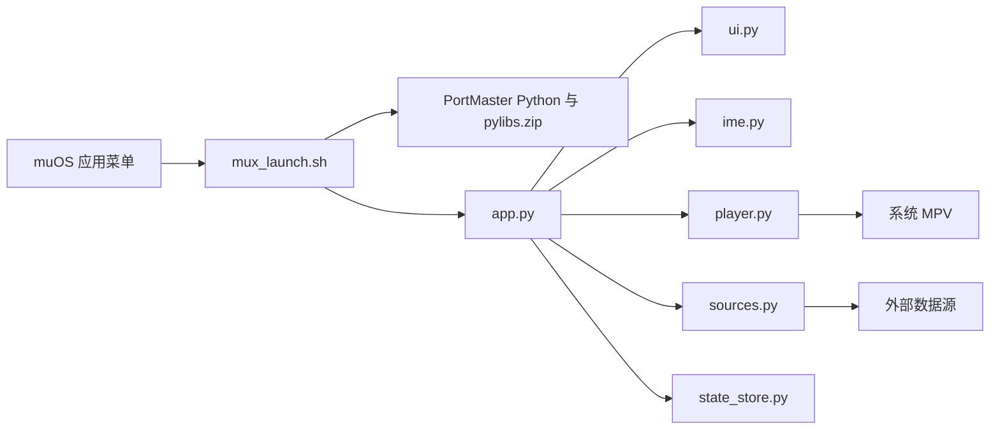

# KazumiLite-muOS 开发与魔改指南

[返回项目主页](../README.md)

这份文档面向希望修改界面、按键、输入法、数据源或播放器行为的贡献者。
它描述的是 `0.2.3-r2` 的实际代码结构。开始修改前，建议先运行现有测试，
并保留一份能在掌机上正常启动的安装包用于回退。

## 先了解运行边界

KazumiLite 不是桌面程序，也不自带完整 Python 环境。它运行在 muOS 中，复用
PortMaster 提供的 Python、PySDL2 和系统 MPV：



有三条兼容底线：

- `mux_launch.sh` 必须保持 LF 换行，不能变成 Windows CRLF。
- 播放结束后的多次重绘和输入冷却用于清理 DRM/framebuffer 残留，不要随意删除。
- 收藏、历史和日志必须继续写入应用自己的 `data/`，不要写系统分区。

## 目录结构

```text
KazumiLite/
├─ mux_launch.sh             # muOS 启动入口和 PortMaster 环境装配
├─ README.txt                # 安装包内说明
├─ KazumiLite.png            # 应用预览图
├─ glyph/                    # muOS 列表图标
├─ grid/                     # muOS 网格图
├─ licenses/                 # 第三方许可证和 NOTICE
└─ data/
   ├─ app.py                 # 页面状态、异步任务、业务编排和按键分发
   ├─ ui.py                  # SDL 绘制和 640x480 布局
   ├─ ime.py                 # 拼音缓冲、候选选择和候选栏窗口
   ├─ player.py              # MPV 生命周期、IPC 控制和环境检查
   ├─ sources.py             # 稀饭、AGE 及 HLS 清晰度选择
   ├─ http_client.py         # HTTP、JSON、Cookie 和网络错误
   ├─ state_store.py         # 收藏、历史、搜索记录和目录缓存
   ├─ config.py              # 路径、版本、站点配置和界面配色
   ├─ backend.py             # 旧导入路径的兼容门面
   ├─ font.ttf               # 中文字体
   └─ pinyin_words.tsv       # 拼音候选词库
```

根目录的 `build.ps1` 负责生成 `.muxapp`，`tests/` 保存不依赖网络和 SDL 的测试。

## 模块依赖规则

为了避免代码重新长成一个大文件，新增功能时尽量遵守下面的方向：

| 模块 | 可以依赖 | 不应该负责 |
| --- | --- | --- |
| `config.py` | Python 标准库 | 网络请求、SDL 绘制、业务状态 |
| `http_client.py` | `config.py` | 理解番剧或剧集结构 |
| `sources.py` | `config.py`、`http_client.py` | 页面跳转、手柄事件、写入收藏 |
| `state_store.py` | Python 标准库 | 网络和界面 |
| `ime.py` | `config.py`、宿主提供的文字测量 | 搜索请求和页面绘制 |
| `ui.py` | `config.py`、PySDL2、只读应用状态 | 网络请求和持久化 |
| `player.py` | `config.py`、PySDL2、MPV、状态存储接口 | 搜索页面和数据源解析 |
| `app.py` | 上述模块 | 具体站点 HTML/API 规则 |

`backend.py` 只负责重新导出旧名称。新代码可以直接从具体模块导入；保留这个文件是
为了不破坏已有脚本和第三方修改。

## 应用如何组合

主类通过 Mixin 组合功能：

```python
class KazumiLiteApp(PinyinMixin, RenderMixin, PlayerMixin):
    ...
```

Mixin 会读取宿主对象上的状态，因此移动字段或重命名时要同步检查调用方：

| Mixin | 依赖的主要状态/方法 |
| --- | --- |
| `PinyinMixin` | `search_query`、`pinyin_buffer`、`pinyin_candidates`、`measure()`、`font_tiny` |
| `RenderMixin` | 页面状态、SDL renderer、字体、列表选择状态、`root_items()` |
| `PlayerMixin` | `detail`、`store`、窗口/renderer、`render()`、`start_job()`、`push_page()` |

Mixin 适合共享同一个应用状态，但不应直接创建新的全局状态。新增较独立的能力时，
优先写成普通类并在 `KazumiLiteApp.__init__()` 中注入。

## 页面与导航

`app.py` 使用字符串表示页面：

| 页面 | 含义 | 绘制函数 |
| --- | --- | --- |
| `root` | 热门、收藏、历史、设置 | `render_root()` |
| `results` | 搜索结果 | `render_results()` |
| `detail` | 线路与剧集 | `render_detail()` |
| `keyboard` | 手柄软键盘 | `render_keyboard()` |
| `diagnostics` | 运行环境检查 | `render_diagnostics()` |
| `about` | 关于与许可 | `render_about()` |

进入新页面使用 `push_page()`，返回使用 `restore_page()`。返回栈同时保存
`page`、`selected`、`scroll` 和 `tab`，因此不要直接修改 `self.page` 来实现普通跳转，
否则返回时可能丢失原列表位置。搜索键盘提交是一个有意的例外，它会原地切换到结果页。

增加页面时通常需要同时修改：

1. `ui.py` 中的 `render()` 分发和新绘制函数。
2. `app.py` 中的 `current_items()`、`visible_count()`、`confirm()` 或 `handle_action()`。
3. `ui.py` 中的 `render_footer()` 按键提示。
4. 返回行为及忙碌状态下的行为。

## 后台任务模型

网络请求不能阻塞 SDL 主循环。`start_job(message, function, callback)` 会在后台线程执行
`function`，再把结果放入 `job_queue`；`poll_jobs()` 在主线程调用 `callback` 并更新界面。

```text
手柄确认
  -> start_job()
  -> 后台线程执行 HTTP/解析
  -> job_queue
  -> SDL 主线程 poll_jobs()
  -> callback 更新页面状态
```

注意：`cancel_job()` 只让当前结果失效，不会强制终止已经发出的网络请求。新增任务时，
回调必须能处理页面已经变化或用户已经取消的情况；不要从后台线程直接调用 SDL。

## 数据源接口

新的数据源至少需要提供 `search()`、`detail()` 和 `playback()`。推荐返回结构如下。

搜索结果：

```python
{
    "id": 123,                 # 同一数据源内必须稳定
    "title": "作品名",
    "subtitle": "2026  12 集",
    "provider": "example",    # 多数据源时建议明确标记
}
```

详情：

```python
{
    "anime": {
        "id": 123,
        "title": "作品名",
        "release_year": 2026,
        "bangumi_score": 8.2,
    },
    "sources": [
        {
            "id": "road-1",
            "code": "1",
            "name": "线路 1",
            "episodes": [
                {
                    "id": 456,
                    "number": 1,
                    "title": "",
                    "label": "第 1 集",
                }
            ],
        }
    ],
}
```

播放信息：

```python
{
    "url": "https://example.test/video.m3u8",
    "fallback_url": "https://example.test/video.mp4",
    "quality": "480p",
    "kind": "hls",
}
```

加入第三个数据源时，还要修改 `search_all_sources()` 和 `open_detail()` 的路由。
当前 AGE 通过 URL 形式的 ID 判断来源，部分历史/收藏逻辑仍偏向整数 ID，这只适合两个
现有数据源；继续扩展前建议统一使用 `provider` 字段建立
`provider -> source instance` 映射，并让历史记录全程按字符串比较 ID，不要继续叠加
URL 或整数判断。

数据源只能解析公开可访问的数据，不应绕过登录、付费、DRM、验证码或其他访问控制。

## 本地状态格式

`state_store.py` 使用临时文件加 `os.replace()` 原子写入，降低断电时损坏 JSON 的概率。
当前结构为：

```json
{
  "favorites": [],
  "history": [],
  "queries": [],
  "catalog": []
}
```

新增字段时需要：

1. 在 `StateStore.__init__()` 中提供安全默认值。
2. 保持旧版 `state.json` 缺少该字段时仍能加载。
3. 限制列表长度，避免 SD 卡上的状态文件无限增长。
4. 为读取旧数据和写回新数据增加测试。

不要把真实的 `state.json`、日志、Cookie 或账号信息加入仓库和安装包。

## 修改界面和主题

颜色集中在 `config.py` 的 `Palette`。布局以 640x480 为基准，通过 `self.px()` 按屏幕
高度缩放。改布局时至少检查：

- 最长中文标题是否被 `ellipsize()` 正确截断。
- 列表行数和 `visible_count()` 是否一致。
- 底部提示是否覆盖列表。
- 候选字被选中后是否始终出现在可见窗口。
- MPV 返回后连续三次重绘是否仍保留。

不要在 `render_*()` 中发网络请求或写状态；绘制函数会在主循环中频繁调用。

## 修改按键

事件到动作的映射位于 `app.py` 的 `handle_event()`，动作的业务含义位于
`handle_action()`。同一个实体键可以根据页面映射为不同动作，例如肩键在键盘页面选择
候选，在详情页切换线路，在播放中快退/快进。

修改按键时同步检查三处：

1. SDL GameController 映射。
2. 原始摇杆/HAT 和外接键盘回退映射。
3. `render_footer()` 与安装包内 `README.txt` 的说明。

保留 `action_allowed()` 的防抖，否则单次按键可能跨过多个项目。

## 增加英文或其他语言

当前界面文字仍直接写在 Python 代码中，没有运行时语言切换。推荐改法是新增
`locales.py`，用稳定键名保存翻译：

```python
STRINGS = {
    "zh_CN": {"settings": "设置", "back": "返回"},
    "en_US": {"settings": "Settings", "back": "Back"},
}

def tr(language, key):
    return STRINGS.get(language, STRINGS["zh_CN"]).get(key, key)
```

随后把语言字段加入 `StateStore`，在设置页提供切换项，并逐步替换 `ui.py`、`app.py`、
`player.py` 和 `sources.py` 中面向用户的字符串。当前 `StateStore.load()` 只接收列表字段，
加入 `language` 这类字符串字段时必须同步扩展读取时的类型校验。日志中的技术文本可以
暂时保持英文。番剧名称来自外部数据源，不应假设它会随界面语言自动翻译。

## MPV 与退出流程

`player.py` 通过 Unix socket 控制 MPV，主要命令包括暂停、相对跳转、读取播放位置和退出。
播放结束后会记录进度；播放超过 92% 的剧集下次从头开始。

下列代码属于掌机兼容关键区：

- IPC socket 的清理和进程兜底终止。
- HLS 失败后的 MP4 回退条件。
- `SDL_ShowWindow()`、窗口尺寸/位置恢复和事件清空。
- 返回后连续重绘 framebuffer。
- `input_blocked_until`，防止退出播放器的按键继续作用到应用。

改播放器参数后要在真机测试正常播放、主动退出、播放失败、HLS 回退和断点续播。

## 构建与测试

运行不联网测试：

```powershell
python -m unittest discover -s tests -v
```

生成安装包：

```powershell
./build.ps1 -Version 0.2.3-r2
```

构建脚本会排除 `__pycache__`、`.pyc`、日志、诊断文件和 `state.json`。新增运行时生成文件后，
要同时更新 `.gitignore` 和 `build.ps1` 的排除规则。

发布新版本时，目前需要同步修改：

- `KazumiLite/data/config.py` 中的 `APP_VERSION`。
- `KazumiLite/mux_launch.sh` 的日志版本。
- `build.ps1` 的默认版本。
- `KazumiLite/README.txt`、`安装与测试.md` 和 `licenses/NOTICE.txt`。

## 真机测试清单

每次改动至少验证以下流程：

- 冷启动能进入主界面，日志中没有导入错误。
- 热门目录能加载，断网时错误信息可读且可以返回。
- 软键盘四向移动正常，拼音候选能左右滚动。
- 搜索结果能进入详情并切换线路。
- 视频能播放、暂停、快进、退出并恢复应用画面。
- 收藏、历史和断点进度在重启后仍存在。
- 环境检查能结束并生成 `diagnostics.txt`。
- 主界面退出后正常返回 muOS，不残留闪烁画面。

发生闪退时先查看：

```text
MUOS/application/KazumiLite/data/log.txt
MUOS/application/KazumiLite/data/mpv.log
```

提交问题时同时提供掌机型号、muOS 完整版本、是否联网、复现步骤和上述日志。

## 提交前检查

```powershell
python -m unittest discover -s tests -v
git diff --check
./build.ps1 -Version test-build
```

再检查生成的 `.muxapp` 中没有 `state.json`、日志、缓存或个人测试文件。涉及 SDL、MPV、
PortMaster 路径、按键或 framebuffer 的修改必须经过真机验证，电脑端语法测试不能替代这一步。

## 许可证与署名

项目代码使用 GPL-3.0-or-later。字体、拼音词库和规则数据有各自许可证，详见
`KazumiLite/licenses/`。新增第三方代码、字体、图片或词库时，需要保留原许可证和署名，
并更新 `NOTICE.txt`。不要提交无权再分发的图标、视频、规则或密钥。
